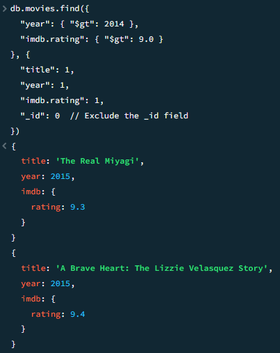
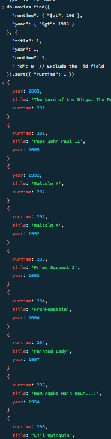

# Movie Database

This project queries a movie database to retrieve important details such as movie ratings and release years. Below are examples of how the data is represented visually.

## IMDB Ratings

This query grabs movies after 2014 and with a higher rating than 9

## Movie Release Year

This query grabs the title, year, and runtime from the database and then displays them increasing by runtime starting at 200 minutes. After you run the query you can type "it" to show more movies.

## Exclusions
Both queries needed to not display the movie id in which we needed to set that to 0
    Example - "_id": 0

This query grabs the 
### Project Details:
This project queries a movie database to get details such as the IMDB rating and the year of release. The images above show examples of the data.
